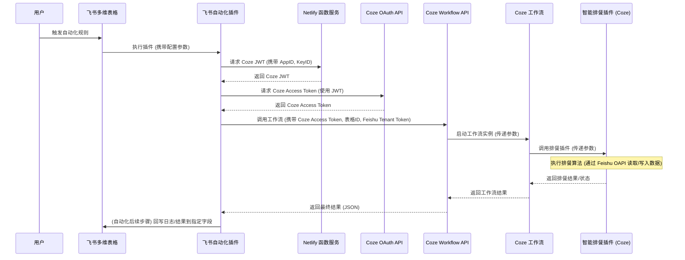

# 系统架构

## 🌐 概述

本系统旨在通过集成飞书多维表格和 Coze AI 平台，实现智能化的排餐功能。用户在飞书多维表格中管理菜品、配置餐类和营养标准，并通过自动化规则触发排餐流程。核心排餐算法部署在 Coze 平台的插件中，并通过 Coze 工作流进行封装和调用。系统利用 Netlify 函数服务安全地处理 Coze API 的认证过程，最终将排餐结果回写至飞书多维表格。

### 组件说明

* **飞书多维表格 (Feishu Bitables)**
  * **作用**: 作为系统的核心数据存储和用户交互界面。
  * **存储**: 存储菜品库 (`01-菜品管理`)、餐类配置 (`05-餐类配置`)、每日营养标准 (`95-营养标准-每日`)、每餐营养标准 (`06-营养标准-每餐`)、系统配置 (`07-系统配置`) 以及生成的排餐方案 (`08-排餐方案-总体`, `09-排餐方案-每天`, `10-排餐方案-每餐`, `11-排餐方案-生成日志`) 等数据。
  * **触发**: 用户通过配置飞书多维表格的自动化规则来启动排餐流程。

* **多维表格自动化插件 (Base Automation Extensions)**
  * **技术栈**: 基于 `@lark-opdev/block-basekit-server-api` 开发的企业自建应用插件。
  * **作用**: 作为自动化流程中的执行节点，负责协调整个排餐任务。
  * **功能**:
    * 接收飞书自动化规则传递的参数（如表格 ID）。
    * 调用 Netlify 函数服务获取 Coze JWT。
    * 使用 JWT 向 Coze OAuth API 请求 Access Token。
    * 携带 Access Token 和业务参数（表格 ID、飞书 `tenantAccessToken` 等）调用 Coze 工作流 API。
    * 将 Coze 工作流的执行结果（如日志或状态信息）输出，供自动化流程后续步骤使用（例如回写到多维表格的 `11-排餐方案-生成日志` 字段）。

* **Netlify 函数服务 (Netlify Serverless Functions)**
  * **作用**: 提供一个安全的 API 端点，用于生成访问 Coze API 所需的 JWT。
  * **安全性**: 该服务封装了 Coze 应用的私钥，避免在飞书插件配置中直接暴露敏感凭证。飞书插件通过调用此服务间接获取 JWT。

* **Coze 平台 (Coze)**
  * **OAuth 认证**: 提供基于 JWT Bearer Grant Flow 的认证机制。飞书插件使用从 Netlify 获取的 JWT 来换取具有一定有效期的 Coze API Access Token。
  * **工作流 (Workflow)**: 封装了智能排餐的业务逻辑。接收来自飞书插件的调用请求和参数（包括用于访问飞书表格数据的 `tenantAccessToken`），并调用内部的智能排餐插件。
  * **智能排餐插件**: 嵌入在 Coze 工作流中的自定义插件，包含核心的排餐算法逻辑。该插件利用工作流传入的飞书 `tenantAccessToken`，通过飞书开平 API (服务端 - Python SDK) 读取多维表格中的菜品、配置等数据以执行计算。

### 交互流程

**数据流**：

1. **触发**: 用户在飞书多维表格操作，触发自动化规则。
2. **插件输入**: 飞书自动化插件接收预设的配置参数（如各表格 ID、Coze App ID、Key ID、Workflow ID 等）和飞书 `tenantAccessToken`。
3. **JWT 获取**: 插件向 Netlify 函数传递 Coze App ID 和 Key ID，获取 JWT。
4. **Access Token 获取**: 插件使用 JWT 向 Coze OAuth API 请求 Coze Access Token。
5. **工作流调用**: 插件向 Coze Workflow API 发送请求，包含 Coze Access Token、Workflow ID 以及业务参数（`app_token`, `dishes`, `meal_config`, `nutrition_std`, `meal_nutrition_std`, `sys_config`, `plan`, `plan_daily`, `plan_meal`, `user_access_token` - 实际为 `tenantAccessToken`）。
6. **工作流执行**: Coze 工作流接收参数，调用内部插件执行排餐逻辑。插件使用传入的 `tenantAccessToken` 回调飞书 API 读取数据。
7. **结果返回**: Coze 工作流将执行结果（通常是包含 `code`, `msg`, `data` 的 JSON 对象）返回给飞书插件。
8. **结果输出**: 飞书插件将 Coze 返回的 JSON 结果字符串化后，作为输出参数 `workflowResult` 传递给飞书自动化流程的后续步骤。`message` 参数提供简单的执行状态文本。
9. **数据回写**: 飞书自动化流程的后续步骤可以将 `message`、`workflowResult` 等结果写入多维表格的相应字段（例如 `11-排餐方案-生成日志`）。

**安全性**：

* **凭证管理**: Coze 应用的 RSA 私钥存储在 Netlify 环境变量中，由 Netlify 函数服务负责生成 JWT，避免了在飞书插件中直接配置私钥，提高了安全性。
* **认证授权**: 系统采用标准的 OAuth 2.0 JWT Bearer Grant Flow 与 Coze API 进行认证，确保了 API 调用的安全性。
* **访问控制**: 通过飞书 `tenantAccessToken` 控制 Coze 插件对飞书表格数据的访问权限。

## 📖 飞书

---

🌻 请前往飞书文档查阅：[https://mealoptima.feishu.cn/base/PgDqbJoYoaTjtNskSEkcv9WJn1d](https://mealoptima.feishu.cn/base/PgDqbJoYoaTjtNskSEkcv9WJn1d)

---

## 🤖 扣子

---

🌻 请前往飞书文档查阅：[https://mealoptima.feishu.cn/base/PgDqbJoYoaTjtNskSEkcv9WJn1d](https://mealoptima.feishu.cn/base/PgDqbJoYoaTjtNskSEkcv9WJn1d)

---

## 🔐 Netlify

Deploy status:

---

🌻 请前往飞书文档查阅：[https://mealoptima.feishu.cn/base/PgDqbJoYoaTjtNskSEkcv9WJn1d](https://mealoptima.feishu.cn/base/PgDqbJoYoaTjtNskSEkcv9WJn1d)